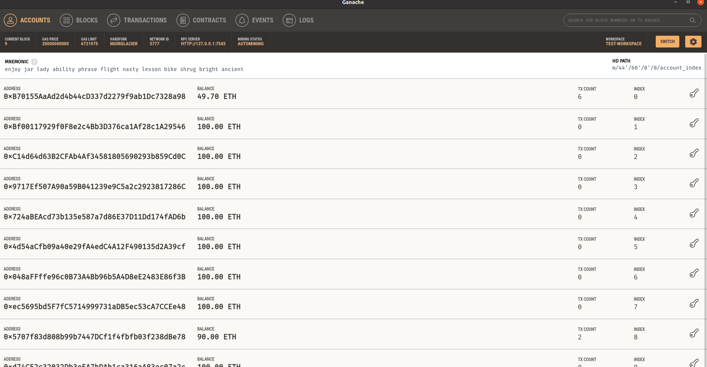
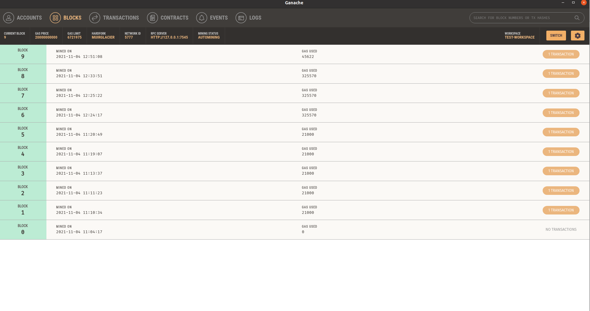

# Description
A simple PoC Ethereum smart contract

# Dependencies
We need install all of these dependencies to develope and deploy a smart contract in a Ethereum local blockchain

- **Metamask chrome extension**: Ethereum chrome wallet manager
  Install Google Extension Metamask from Chrome extensions

- **Ganache**: Ethereum local Blockchain
    Download from [trufflesuite](https://www.trufflesuite.com/ganache) 

  Also we could use **ganacle-cli** from:
  ```javascript
  npm install ganache-cli@latest --global
  ```

- **Web3**: deploy and manage smart contracts
  ```javascript
  npm install web3 --save
  ```

- **solcjs**: Solidity compiler
  ```javascript
  npm install ganache-cli@latest --global
  ```

# Ethereum smart contract compiler
  ```javascript
  npm install solc --global
  ```

This command generate the smart contract binary NotarizedDocument.bin and the interface NotarizedDocument.abi for the contract

# Configurations
We must create a workspace in ganache called Ganache, by default it runs on 7545 port. This workspace create 10 accounts with 100 ETH everyone to deploy smart contracts



Then from Metamask client import one of the default wallets created in the Ethereum blockchain. We must to use the private key obtained from the ganache accounts


# Deploy the smart contract
```javascript
node deploy-contract.js
```

We could see the blockchain blocks


# Execute the smart contract

```javascript
node execute-contrack
```

We could see the blockchain transactions
